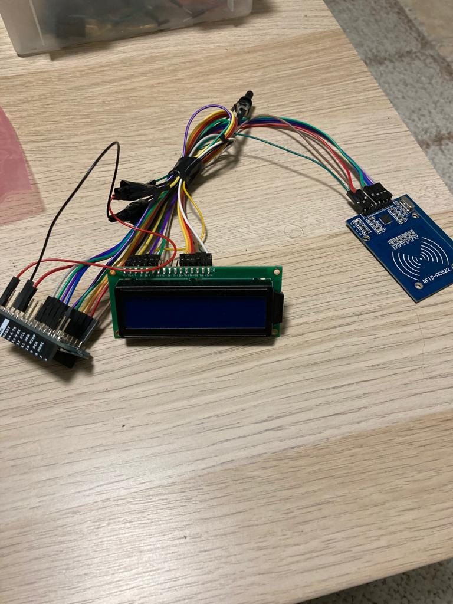

<h1 align="center">
	A device for reading winner and loser of played game and then sending those to server, used for stats.
</h1>

	 
	

## Notes
In this [Video](/assets/arduino-mkr1000-compressed.mov) you can see this gadget in action.
- API and UI are still private
