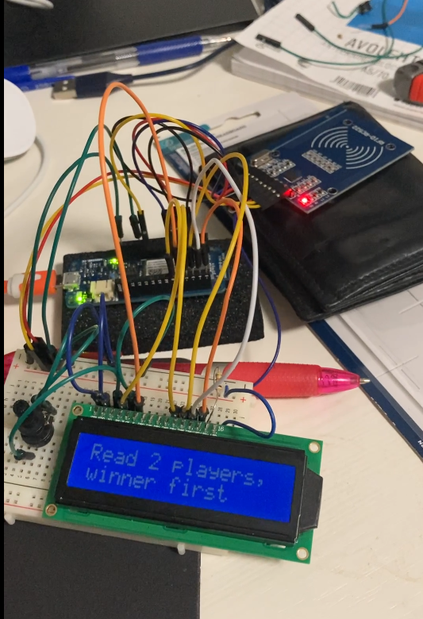

<h1 align="center">
	A device for sending played games to a server
</h1>

	 
	

## Notes
[Video](/assets/arduino-mkr1000-compressed.mov) is also available for download
- API and UI are still private
